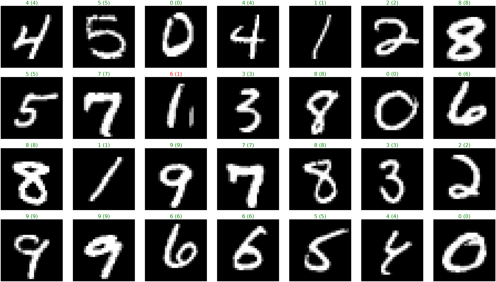
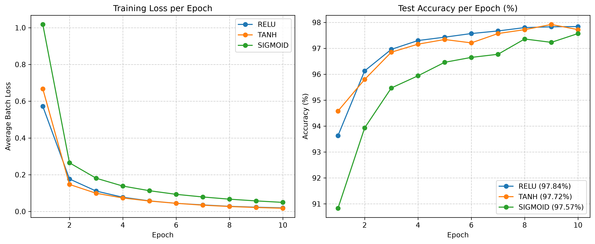
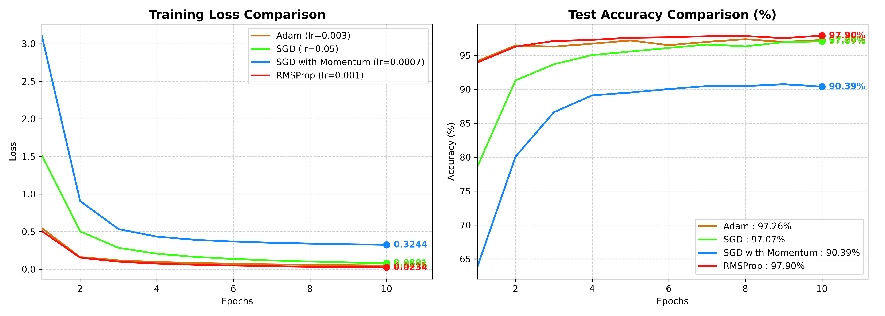

# dist-ml-framework

A lightweight, $N$-dimensional tensor library and automatic differentiation engine built from scratch in Python and NumPy.

Inspired by [micrograd](https://github.com/karpathy/micrograd), but scaled up from scalar values to vectorized tensor operations.

## Dependencies

* Python 3.8+
* NumPy
* Matplotlib (for running benchmarks)
* Torchvision (for downloading the MNIST dataset)

```bash
pip install numpy matplotlib torchvision

```

## Quick Example

```python
import numpy as np
from micrograd.multi_dim_engine import Tensor

# Define tensors with gradient tracking
a = Tensor(np.array([[1.0, 2.0], [3.0, 4.0]]))
b = Tensor(np.array([[2.0, 0.0], [1.0, 3.0]]))

# Forward pass
c = a @ b
d = c.relu()
loss = d.sum()

# Backward pass
loss.backward()

print("a grad:\n", a.grad) #prints a grad: [[2. 4.],[2. 4.]]
 
print("b grad:\n", b.grad) #prints b grad: [[4. 4.],[6. 6.]]
 
```

## Running MNIST

We evaluated a 3-layer MLP ($784 \to 128 \to 64 \to 10$) trained with custom Adam optimizer and fused Softmax Cross-Entropy loss across 10 epochs. Where we reached a 97.72% accuracy and a 0.0175 final loss.



### Activation Benchmarks

After completing the `multi_dim_engine` and training a neural network (`neural_network.py`) using the ReLU activation function—reaching over 97.5% accuracy on MNIST dataset. We wanted to see what kind of differences would appear when using other activation functions like Sigmoid and Tanh. Since these are also among the most famous activation functions, we decided to compare them side-by-side so we could see firsthand why ReLU is so popular and why it remains the default choice in modern neural networks.

The results are illustrated in the graph below : 



* ReLU: 97.84% test accuracy (Final Loss: `0.0193`)
* Tanh: 97.72% test accuracy (Final Loss: `0.0175`)
* Sigmoid: 97.57% test accuracy (Final Loss: `0.0494`)

## Optimizer Benchmarks

Following the activation function tests, we compared four main optimizers— SGD, SGD with Momentum (SGDM), RMSProp, and Adam —on the MNIST dataset to see how learning rate adjustments and momentum affect training speed and accuracy.

While **RMSProp** finished with the highest score (97.90%), **Adam** (97.26%) clearly showed why it is the default choice for most neural networks. Adam worked almost perfectly on the very first try using default settings (`lr=0.003`), needing zero time spent on tweaking parameters.

In contrast, the other optimizers required a lot of extra effort:

* **SGD & SGDM:** Finding the right learning rate took hours of frustrating trial-and-error. Small mistakes caused the models to fail completely (getting stuck at 11.35% accuracy) or learn too slowly. Even after a lot of tuning (`lr=0.0007`), SGDM only reached 90.39%, while plain SGD eventually hit 97.07% (`lr=0.05`).

* **RMSProp:** It got the top score (97.90%), but only after adjusting the learning rate down to `0.001` so it wouldn't jump past the best solutions.

This test proves a big practical point: while traditional methods like SGD can get good results if you spend hours tweaking them, Adam saves developers tons of time by giving great performance right away.

The results are illustrated in the graph below:



* Adam: 97.26% test accuracy (Final Loss: `0.0475`)
* SGD: 97.07% test accuracy (Final Loss: `0.0801`)
* SGD with momentum: 90.39% test accuracy (Final Loss: `0.3244`)
* RMSProp: 97.90% test accuracy (Final Loss: `0.0234`)

## Under the Hood

* **The Computational Graph:** As you do operations (`+`, `@`, `relu`), we track them in a directed graph. Calling `.backward()` visits nodes in reverse topological order so every tensor gets its gradients in the exact right sequence.
* **Vectorized Autograd:** Instead of tracking scalar floats one-by-one, we track $N$-dimensional arrays. Matrix multiplications use $A^T$ transpose rules, and batch broadcasting automatically sums gradients back down to match the original tensor shape.
* **Fused Loss Trick:** Softmax and Cross-Entropy are merged into a single clean math step ($\frac{\partial L}{\partial z_i} = p_i - y_i$). We subtract the maximum value before exponentiating so numbers don't explode into `inf` or `NaN`.
